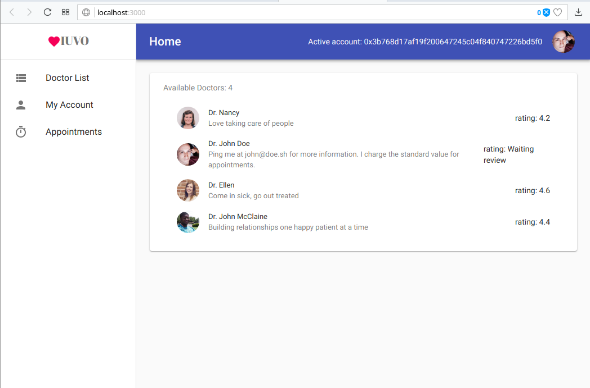
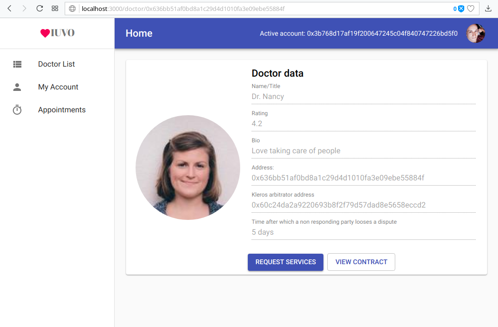
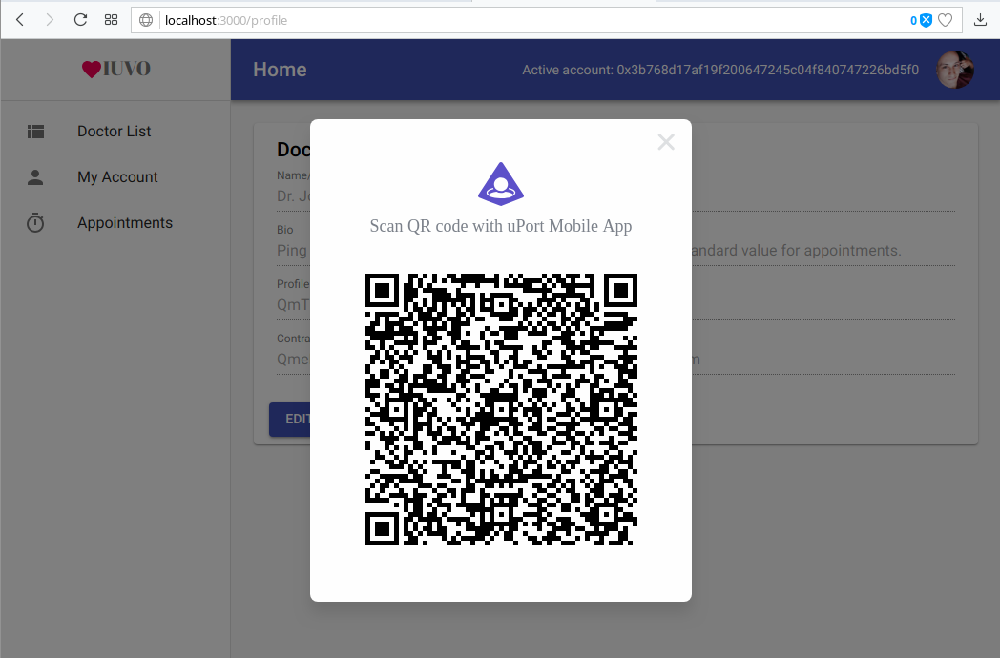
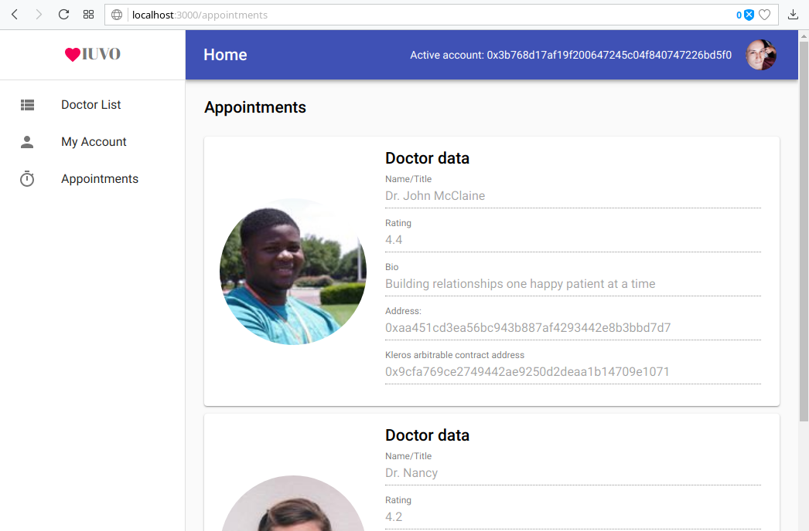

 
 

    

 
 

> The decentralized health services marketplace.

On `iuvo`, you can hire doctors or put your services up on a list to be hired.

## What is this?

TODO

When you hire a doctor, a new [Kleros](https://kleros.io/) arbitrable transaction contract is deployed, which gives both parties an oportuninty to appeal if there is a dispute.

- User story 1
- User story 2
- ...

**Features:**
- Upgradable pattern;
- uPort integration;
- IPFS integration;
- Kleros integration;
- Circuit breaks;
- Acess restrictions;
- EthPM package usage;
- Automated tests;
- Material UI.

## Notes for the reviewer

TODO: Ask me for test ether

## Tests

1. `ganache-cli` in one terminal;
2. `truffle test` in another.

This project was built using the [Truffle Framework](https://truffleframework.com), with tests written with mocha and chai so they can be found inside the `test` folder.

## Install

Simply run `npm install`

## Usage

The frontend depends on uPort and usage depends on weather:
1. You want to interact with the contracts already deployed on Rinkeby testnet;
2. You want to interact with your own, newly deployed contracts instances to Rinkeby;
3. You want to interact with contracts on your own testnet.

> If you are a reviewer, you want option 1: interact with the contracts already deployed. See the next section.

### Interacting with the deployed contracts

> This is what you want to grade this project.

This project's frontend uses [uPort's](https://www.uport.me/) infrastructure for interaction and authentication. This means that:
- You don't need Metamask, but you do need a smartphone with uPort installed. 
- You will interact with the contracts already deployed on Rinkeby.

See below on how to use the frontend with your own instances of the contracts.

TODO: Ask me for test ether
TODO: QR codes may get big.

Simply run `npm start` to serve the frontend.

### Interacting with new contracts

For new contracts we have two options: deploy on a local testnet and deploy on rinkeby.

#### Local testnet: 

If you choose to deploy locally, you will have to interact with the contracts directly through the `truffle console`. This is because the frontend requires uPort's infrastructure and smart contracts.

Also note that to hire a doctor, you need to pass the function an address of an arbitrator. This can be any address if you don't plan on raising a dispute (you probably don't).

#### Rinkeby testnet:

If you choose to deploy the contracts to Rinkeby, you get the benefit of using the frontend. But you need to update it's configuration with your own dapp data:

1. See [uPort's documentation](https://developer.uport.me/gettingstarted#1-get-the-u-port-app) on how to register.
2. Update `src/util/connectors.js`
3. `npm start`

## Screenshots

## License

MIT © 2018 Matheus Alencar
